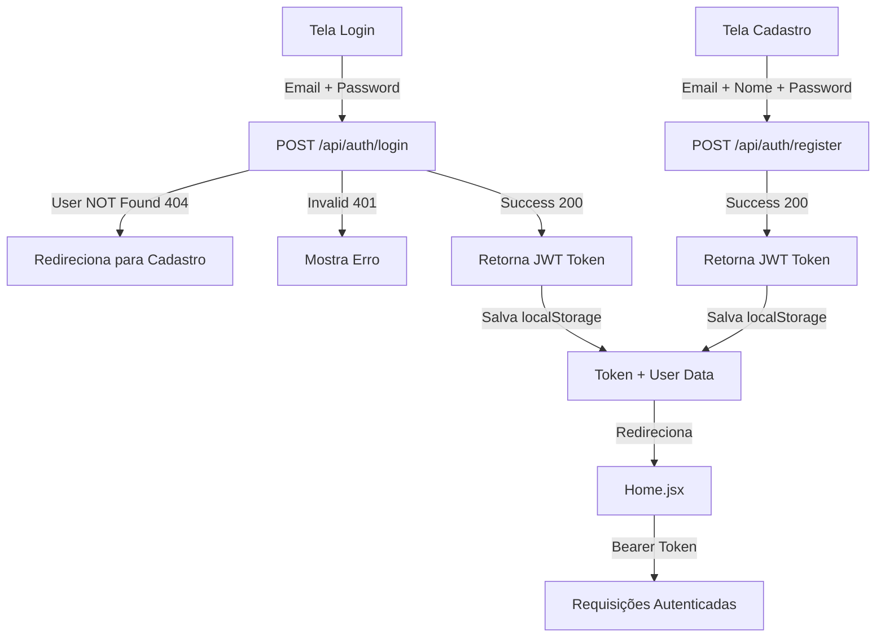

# 🚀 Setup - Autenticação com Spring Backend

## Fluxo Implementado



## Endpoints Esperados do Backend (Spring)

### 1. **POST /api/auth/login**
Login com email + senha

**Request:**
```json
{
  "email": "user@example.com",
  "password": "senha123"
}
```

**Response (200 OK):**
```json
{
  "token": "eyJhbGciOiJIUzI1NiIsInR5cCI6IkpXVCJ9...",
  "user": {
    "id": 1,
    "email": "user@example.com",
    "name": "João Silva",
    "role": "USER"
  }
}
```

**Response (404 Not Found):**
- Usuario não encontrado → Frontend redireciona para cadastro

**Response (401 Unauthorized):**
- Senha incorreta → Frontend mostra erro

### 2. **POST /api/auth/register**
Créate nova conta

**Request:**
```json
{
  "email": "newuser@example.com",
  "name": "Jane Doe",
  "password": "senha123",
  "confirmPassword": "senha123"
}
```

**Response (200 OK):**
```json
{
  "token": "eyJhbGciOiJIUzI1NiIsInR5cCI6IkpXVCJ9...",
  "user": {
    "id": 2,
    "email": "newuser@example.com",
    "name": "Jane Doe",
    "role": "USER"
  }
}
```

**Response (409 Conflict):**
- Email já cadastrado → Frontend mostra erro

## Variáveis de Ambiente

Copie `.env.example` para `.env`:

```bash
cp .env.example .env
```

Edite `.env` com sua URL do backend:

```env
VITE_API_URL=http://localhost:8080/api
VITE_ENVIRONMENT=development
```

## Iniciando o Servidor Dev Vite

```bash
npm run dev
```

Acesse em: `http://localhost:3000`

## Fluxo de Teste Manual

### 1. **Testar Login OK**
1. Ir para `http://localhost:3000/login`
2. Email: `test@example.com`
3. Password: `senha123`
4. Sucesso → redireciona para `/`
5. Token salvo em localStorage (`wun_token`)

### 2. **Testar Login - Usuário Não Existe**
1. Email: `nonexistent@example.com`
2. Password: qualquer coisa
3. Backend retorna 404
4. Frontend redireciona para `/cadastro` com email pré-preenchido

### 3. **Testar Cadastro**
1. Ir para `http://localhost:3000/cadastro`
2. Email: `newuser@example.com`
3. Nome: `Novo Usuário`
4. Password: `senha123`
5. Confirm Password: `senha123`
6. Sucesso → salva token + redireciona para home

## Integração com Outras Rotas

Todas as requisições HTTP automaticamente incluem o Bearer Token no header:

```javascript
// api.js interceptador
Authorization: Bearer {token}
```

Exemplo de uso em qualquer serviço:

```javascript
import api from './api'

// Automaticamente adiciona Authorization header
const response = await api.get('/videos/list')
```

## Middleware de Autenticação (Spring)

O Backend deve:

1. **Validar JWT token** em todas requisições autenticadas
2. **Retornar 401** se token expirado/inválido
3. **Retornar 403** se usuário sem permissão

Frontend interceptará e:
- **401** → Limpa localStorage + redireciona para `/login`
- **403** → Redireciona para `/`

## Estrutura de Pastas

```
src/
├── pages/
│   ├── Login.jsx          # Tela de login (email/password)
│   ├── Cadastro.jsx       # Tela de cadastro
│   └── ...
├── services/
│   ├── authService.js     # Lógica de autenticação (login/signup)
│   └── api.js             # Cliente HTTP com interceptadores
├── context/
│   └── AuthContext.jsx    # Estado global de autenticação
└── ...
```

## Próximos Steps

1. ✅ Remover OAuth (Google/Apple) - FEITO
2. ✅ Implementar login simples com email/password - FEITO  
3. ✅ Fluxo: login falha → redireciona para cadastro - FEITO
4. ⏳ Testar integração com Spring Backend
5. ⏳ Implementar rotas autenticadas (Videos, Upload, Pagamento)

---

**Pronto para testar com localhost:8080 (Spring Backend)!** 🎯
